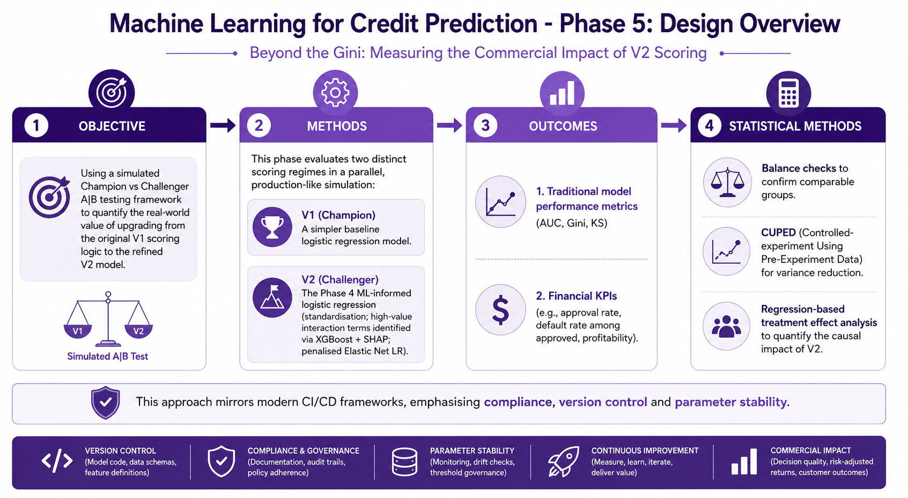

# Machine Learning for Credit Prediction: Phase 5
## Beyond the Gini: Measuring the Commercial Impact of V2 Scoring

---

### Background and Aim 

In modern data science and financial services, building an accurate model is only the first step. The real challenge lies in proving that a new model delivers measurable business value when deployed in a live environment. This is where rigorous A/B testing (or Champion vs Challenger testing) becomes essential.

A/B testing allows organisations to compare a new algorithm (Challenger) against the current production system (Champion) under controlled, parallel conditions. It provides clear, causal evidence of uplift in key outcomes such as approval rates, default rates, profitability, and customer reach. This methodology is widely used across industries - from retail and e-commerce to pharma, biotech, and manufacturing - where algorithms are continuously tested in real time to improve production efficiency, decision quality, and customer experience.

In credit risk, A/B testing is particularly valuable because it supports regulatory compliance, model governance, and change management requirements. It ensures that any upgrade is not only statistically superior but also delivers tangible financial and inclusion benefits before full deployment. Building on the stable, regulator-ready hybrid scorecard created in Phase 4, this phase uses a simulated Champion vs Challenger A/B testing framework to quantify the real-world value of upgrading from the original V1 scoring logic to the refined V2 model.

---

### Methods 

This phase evaluates two distinct scoring regimes in a parallel, production-like simulation:

- V1 (Champion): A simpler baseline logistic regression model using a limited set of higher-order DRA psychometric factors (no standardisation, no interaction terms).

- V2 (Challenger): The Phase 4 hybrid scorecard, which incorporates standardisation of DRA factors, six high-value interaction terms identified via XGBoost + SHAP analysis, and a penalised Elastic Net logistic regression for improved stability and regulatory explainability.

Outcomes were evaluated using both traditional model performance metrics (AUC, Gini, KS) and financial KPIs (e.g., approval rate, default rate among approved, profitability).

Statistical Methods: 

- Balance checks to confirm comparable groups.

- CUPED (Controlled-experiment Using Pre-Experiment Data) for variance reduction.

- Regression-based treatment effect analysis to quantify the causal impact of V2.

This approach mirrors modern CI/CD frameworks, emphasising compliance, version control and parameter stability. The same logic applies across industries where algorithms are continuously tested and optimised in real-time production environments.

--- 

### Data

This analysis uses real **psychometric assessment data**. The scores have been scaled such that risk reduces as the score increases. 

To protect intellectual property, the names of the DRA variables have been generalized or renamed in this public version. The underlying constructs and relationships remain representative of the actual assessment. All financial data is simulated to match realistic distributions, correlations, and patterns from the original analysis (based on a thin-file population). No real candidate or client information is included.

---

## How to view the report

The full rendered report is available via **GitHub Pages**: 

xxx

---

### Technologies used
The analysis was conducted in R using the following packages:

### Analysis
- ggplot2
- patchwork
- pROC
- glmnet
- caret

---
